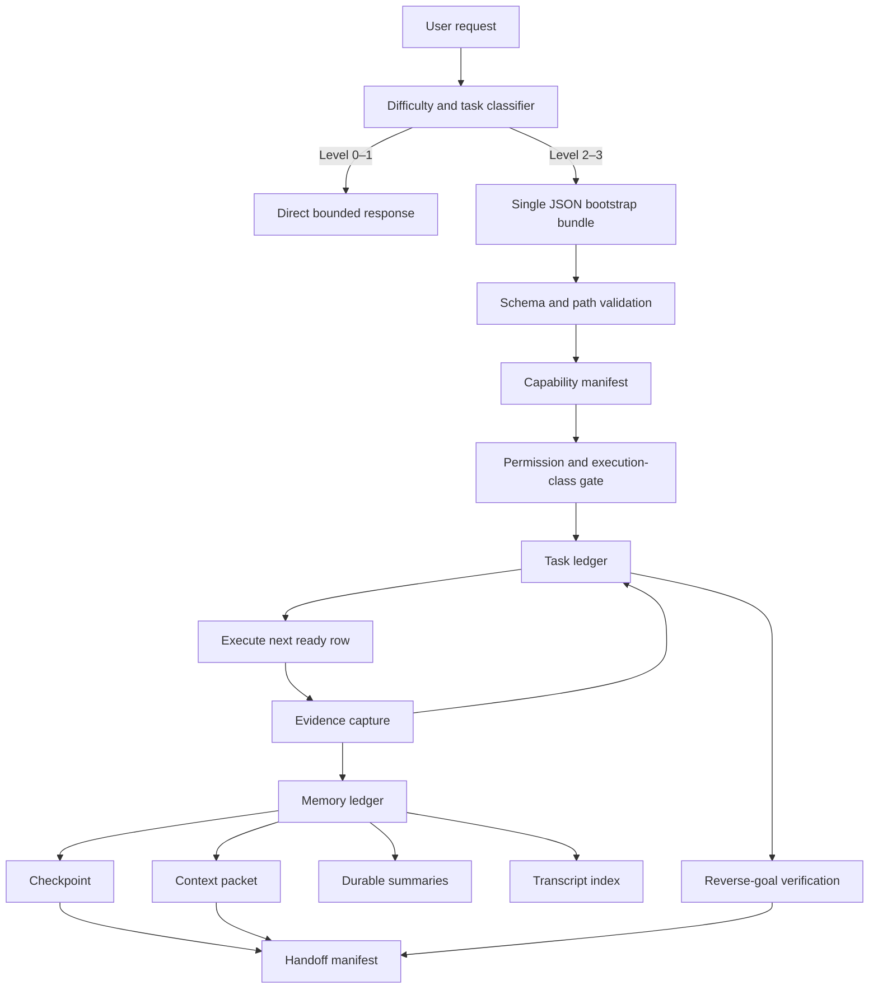

# Adaptive Task Orchestrator v2 — Build and Strict Assessment

Date: 2026-07-15  
Repository root: `adaptive-task-orchestrator/`

## Outcome

The skill was rebuilt from a broad prompt policy into a bounded orchestration layer with three executable utilities and one packaged regression test:

- `memory-ledger.ps1`: context, checkpoint, durable memory, transcript lineage, capability history, compaction lineage, verification, expiry, and deletion.
- `task-ledger.ps1`: dependency gates, permission states, execution classes, mutation serialization, retries, evidence gates, and state verification.
- `bootstrap-orchestrator.ps1`: one-file, idempotent initialization of the complete handoff state.
- `self-test.ps1`: reproducible bootstrap, path-length, dependency, evidence, memory, and task-ledger regression checks.

The main `SKILL.md` remains policy and routing. It does not falsely claim to enforce client permissions, run in the background, synchronize clients, or generate semantic summaries without model work.

## Runtime architecture



The bootstrap bundle is the only initial input. Separate event, row, checkpoint, and capability files are created only after the verified handoff exists.

## Requirement-by-requirement result

| # | Requested capability | Result | Concrete implementation | Boundary |
|---|---|---|---|---|
| 1 | Adaptive dialogue for complex mathematics and code | Implemented | Narrow difficulty gate; separate mathematics and code workflows; assumptions, decomposition, independent verification, expected behavior, error or risk reporting | It routes reasoning; it is not a symbolic solver, compiler, or test environment by itself |
| 2 | Time-compressed memory with purpose/content directories | Implemented with model-mediated semantics | Purpose/content hierarchy; event → weekly → monthly → durable lineage; reciprocal source coverage; current context and checkpoint pointers; retention and deletion rules | The ledger schedules compaction jobs and verifies lineage, but the semantic summary text must be produced by a model or future summarizer adapter |
| 3 | Task recognition, summaries, and prompt templates | Implemented | Task-type classifier; difficulty routing; execution prompt, resume prompt, scheduled continuation prompt, and self-check template | Classification quality still depends on the active model |
| 4 | Complete document retrieval/edit planning flow | Implemented as routing policy | Native structured API first; readback/parser/render/formula verification; source preservation; execution-class assignment | Actual document access depends on installed connectors or local document tools |
| 5 | Long-task timers, wakeup, and custom continuation | Capability-gated | Checkpoint, exact next action, resume prompt, schedule record requirements, timezone and readback rules | True wakeup/background work is impossible without a native automation surface; the skill refuses to simulate it |
| 6 | Long-task table, primary path, reverse-goal self-check | Implemented and machine-checked | Task-row schema, topological dependencies, one active mutation, evidence IDs, retries, checkpoint rules, reverse evidence trace | Evidence quality still requires correct inspection of the underlying artifact |
| 7 | Enable features by difficulty | Implemented | Routine one-step work excluded; explicit Level 0–3 routing; only required modules activate | Explicit skill invocation can override the automatic boundary |
| 8 | Long and difficult task integration | Implemented | Single bootstrap, task/memory separation, checkpoints, handoff manifest, recovery and verification | Cross-session use requires access to the same state path or exported checkpoint |
| 9 | Self-situation analysis and client/CLI routing | Implemented as capability state | Client, workspace roots, tools, permissions, side effects, resume support, refresh rules, continuation capability, transcript/fork lineage | It records and gates capabilities; it does not dynamically install tools or synchronize unrelated clients |

## Mapping to `claude-code-sourcemap`

The detailed source review is in `docs/source-map-gap-analysis.md`. The relevant structural ideas were applied as follows.

| Source-map idea | Way/type used in the source | v2 correspondence | Remaining difference |
|---|---|---|---|
| Separate active context, persistent memory, and transcript | Runtime context management and session history | Four separate state objects: context packet, checkpoint, durable memory, transcript index | This skill cannot inject context into a client runtime by itself |
| Tool input validation | Schema and runtime checks | Structural → value/path → capability → permission → execution class → evidence → transition chain | Validation schemas are PowerShell logic, not a general RPC type system |
| Permission and capability gates | Runtime authorization/tool availability | Capability manifest plus row permission state and execution class | Capability discovery is snapshot-based unless a client adapter refreshes it |
| Parallel reads and controlled writes | Concurrency policy | Independent `read_only` rows may run concurrently; mutations are serialized; exclusive file locks protect ledgers | No distributed lock across machines |
| Forks and sidechains | Session lineage | Session IDs, parent checkpoint/session, fork number, sidechain number, transcript index | It records lineage but does not create native client forks |
| Resumption | Session persistence and recovery | Checkpoint, current context, handoff manifest, exact next action, idempotency keys | Resume must be invoked by the client or user when no wakeup API exists |
| Bounded context | Runtime token/context management | Context packet selects uncovered high-value sources and uses a character budget | Character limits are an approximation; token-aware packing is not implemented |
| MCP/tool routing | Dynamic tool interfaces | Capability records and document/client routing policy | No dynamic MCP enumeration adapter is bundled in the skill |

## Important improvements over v1

1. Trigger scope is narrower. Routine summaries, one-step answers, and short plans no longer activate the full system automatically.
2. Context, checkpoint, durable memory, and transcript history are no longer conflated.
3. Task progress is not accepted from prose alone; passed rows require evidence.
4. A mutation cannot start while another mutation row is active.
5. Resume safety uses dependency state, permission state, retries, checkpoints, and idempotency keys.
6. Context is invalidated after relevant writes, preventing stale recall.
7. Summary source coverage is reciprocal and verified across weekly, monthly, and durable tiers.
8. Read-only operations do not create missing state.
9. Bootstrap is hash-idempotent and refuses a different or partial bundle at the same root.
10. Long Windows path segments now use a readable prefix plus stable eight-character hash; legacy unbounded v2 paths remain discoverable.

## Verification evidence

| Test | Result | Evidence checked |
|---|---|---|
| Packaged `self-test.ps1` | PASS | Idempotent bootstrap, deliberately long slugs, dependency gate, evidence gate, two passed rows, memory/task verification |
| Memory lifecycle smoke test | PASS | Eight events, weekly/monthly/durable compaction, reciprocal lineage, capability history, checkpoint, context, transcript, fork, recall, deletion rules |
| Task lifecycle smoke test | PASS | Three rows, dependency blocking, evidence blocking, scheduled checkpoint rule, retries, final verification |
| Concurrent append test | PASS | Six independent PowerShell writers, six retained events, zero worker errors, valid ledger |
| Absent-state read test | PASS | Read failed without creating a directory |
| Bootstrap compatibility test | PASS | A pre-bounded-slug v2 ledger was rediscovered and reverified without migration |
| Independent mathematics scenario | PASS after one recovered setup fault | Six-row PDE proof/empirical plan, valid memory and task ledgers, no unsupported execution |
| Independent code handoff scenario | PASS after two recovered setup faults | Nine-row CLI-to-desktop plan, valid memory and task ledgers, mutation permissions requested, no external access |
| Post-scenario independent verification | PASS | Mathematics: 6 rows, 0 memory/task issues; code: 9 rows, 0 memory/task issues |
| Official skill quick validator | PASS | Skill package structure and frontmatter |
| Static checks | PASS | 124-line `SKILL.md`, 7 references, 4 scripts, 0 missing links, 0 TODO/FIXME markers, 0 PowerShell parse errors |

The forward scenarios exposed the Windows path-length defect instead of hiding it. The fix was then added to the runtime and the regression suite. The code scenario also exposed an invalid event kind in the test bundle; the schema correctly rejected it.

## Strict score

These scores assess actual capability, not the ambition of the prompt.

| Area | Score | Reason |
|---|---:|---|
| Triggering and task routing | 8.5/10 | Narrow, explicit, and usable; model classification remains probabilistic |
| Task state and recovery | 9.0/10 | Machine-checked transitions, dependencies, evidence, retries, idempotency, checkpoints |
| Memory structure and auditability | 8.5/10 | Strong separation and lineage; semantic compression is not autonomous |
| Long-task continuation | 7.0/10 | Excellent handoff state; actual wakeup depends on native runtime support |
| Cross-client capability routing | 7.5/10 | Clear capability snapshot and refresh policy; no live adapter or synchronization service |
| Document workflow | 7.5/10 | Complete policy path; execution depends on external document capabilities |
| Testability and maintainability | 9.0/10 | Packaged self-test, official validation, focused runtime and forward tests |
| Overall | **8.3/10** | Strong local orchestration skill; not an autonomous agent runtime |

## Plugin decision

No plugin is required for the core v2 skill. A plugin would add packaging complexity without improving the local task and memory ledgers.

A plugin becomes justified only when one bundle must ship one or more of these runtime integrations:

- an MCP server for dynamic capability discovery or shared remote state;
- an automation service for verified wakeups and background continuation;
- a connector adapter for Google Drive, SharePoint, Slack, Linear, or another external system;
- a cross-client synchronization service with authentication and conflict handling.

The correct current architecture is therefore:

```text
core policy and local state = skill
external runtime integrations = optional plugin/MCP/connectors
native scheduling = client automation capability
```

Installing a general connector plugin is not recommended merely to make the skill look more complete. Install one only for a concrete external system in scope.

## Remaining work worth doing

The following are valid future extensions, not missing claims that should be papered over:

1. Add a token-aware context packer behind a capability interface.
2. Add an optional semantic summarizer adapter that writes summaries and then runs ledger verification.
3. Add client-specific capability probes for Codex Desktop, CLI, and other supported clients.
4. Add native automation integration when a callable schedule/wakeup API is present.
5. Add a migration command if the schema advances beyond v2.
6. Add fault-injection tests for interrupted atomic writes and corrupted JSON.
7. Add a connector/plugin only after a specific external system and permission model are selected.

## Final judgment

The requested architecture is substantially implemented and usable for difficult, multi-stage, and resumable local work. The v2 design correctly separates policy, state, evidence, and runtime capability. It also explicitly refuses impossible claims.

It is not a self-running background agent, a universal cross-client memory service, or an autonomous semantic compression engine. Those functions require runtime services outside a skill and should remain capability-gated extensions.
