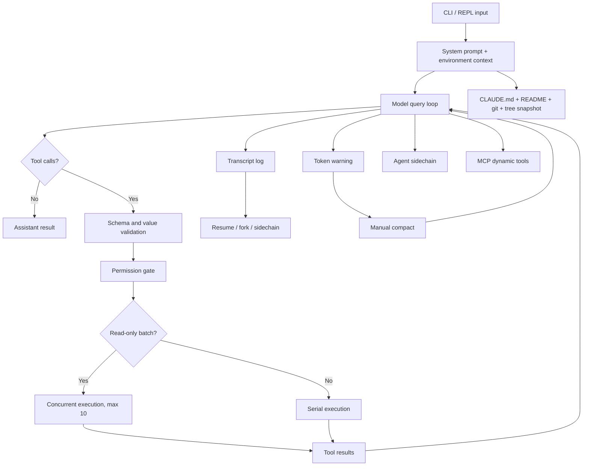

# Claude Code Sourcemap Framework and Skill Gap Analysis

## 1. Scope and reliability boundary

Source package: `claude-code-sourcemap-main.zip`

The package identifies itself as Claude Code Research Preview `0.2.8`, reconstructed from source maps. Treat it as a historical implementation sample, not current Claude Code documentation or a stable API contract.

Two apparent capabilities are disabled in this source:

- `MemoryReadTool.isEnabled()` and `MemoryWriteTool.isEnabled()` return `false`.
- `ArchitectTool.isEnabled()` returns `false`.

The `/resume` command is also restricted to an internal user type. Therefore, distinguish implemented code paths from generally available product behavior.

## 2. Main application framework



This is primarily a runtime architecture. Our current Skill is primarily an instruction architecture. That difference explains most of the gap.

## 3. Application structure with method and type annotations

| Structure point | Source path | Method used | Type | Runtime behavior |
|---|---|---|---|---|
| CLI interaction | `src/screens/REPL.tsx` | React Ink state loop | UI/runtime | Collect input, assemble context, stream model and tool messages, record transcripts |
| Main agent loop | `src/query.ts` | Recursive async generator | Agent runtime/state machine | Query model, execute tools, append results, query again until no tool call remains |
| Tool contract | `src/Tool.ts`, `src/tools.ts` | Typed tool registry | Interface/plugin architecture | Register name, schema, prompt, permission behavior, read-only classification and async execution |
| Input validation | `src/query.ts` | Zod `safeParse` plus tool-specific validation | Schema validation | Reject malformed structure before permission checks and execution |
| Read/write scheduling | `src/query.ts` | Read-only classification | Concurrency control | Run all-read-only batches concurrently, up to 10; run batches containing mutation serially |
| Permission control | `src/permissions.ts` | Exact command, prefix and tool permission keys | Policy gate | Fail closed on ambiguity or detected command injection; distinguish session and persistent permission |
| Project context | `src/context.ts` | Memoized parallel collectors | Context injection/cache | Collect git status, directory tree, README, code style and CLAUDE files once per conversation |
| Project memory | `src/constants/prompts.ts`, `src/utils/style.ts`, `src/commands/init.ts` | Repository-local `CLAUDE.md` | Durable declarative memory | Store build/test commands, code conventions and stable repository knowledge; inject into context |
| Context warning | `src/components/TokenWarning.tsx` | Token thresholds | Resource monitor/UI guard | Warn at 60% of a 190k limit and escalate at 80%; tell user to compact |
| Conversation compaction | `src/commands/compact.ts` | LLM-generated summary followed by message replacement | Lossy context compression | Summarize the transcript, clear messages and caches, start a fork with the summary in context |
| Transcript persistence | `src/hooks/useLogMessages.ts`, `src/utils/log.ts` | Full JSON overwrite | Event/transcript store | Persist conversation messages with time, working directory, session, version and fork metadata |
| Resume | `src/commands/resume.tsx`, `src/screens/ResumeConversation.tsx` | Deserialize saved messages | Session recovery/forking | Select a log, restore messages and continue in a new fork |
| Subagent | `src/tools/AgentTool/*` | Independent model trajectory | Stateless sidechain agent | Receive one complete prompt, use filtered tools, return one final report, and save a sidechain log |
| Subagent isolation | `src/tools/AgentTool/prompt.ts` | Tool filtering | Capability sandbox | Remove recursive Agent; default to read-only tools unless dangerous permission skipping is enabled |
| Planning agent | `src/tools/ArchitectTool/*` | Separate system prompt and filtered exploration tools | Specialized read-only agent | Analyze requirements and return an implementation plan without intentionally modifying code |
| MCP extension | `src/services/mcpClient.ts` | Capability discovery and dynamic tool wrapping | Plugin/adapter layer | Connect through stdio or SSE, namespace tools, validate protocol results and merge config scopes |
| Experimental file memory | `src/tools/MemoryReadTool`, `MemoryWriteTool` | Files under a fixed memory directory | File-backed memory tool | List an index and files, read one file, or overwrite one file; disabled in this source |
| Notification | `src/services/notifier.ts`, `src/hooks/useNotifyAfterTimeout.ts` | Terminal bell/iTerm escape sequence | Attention notification | Notify after inactivity; does not schedule work and does not wake a stopped process |
| Command generation | `src/commands/init.ts` | Prompt template | Repository onboarding | Ask the agent to create or improve a concise CLAUDE.md from repository evidence |

## 4. Core design ideas worth retaining

### 4.1 Separate context compression from durable memory

The source uses different mechanisms:

- `/compact` compresses the active conversation so execution can continue.
- `CLAUDE.md` stores stable repository instructions.
- transcript JSON preserves full recoverable history.
- experimental Memory tools target a separate file directory.

Our Skill currently places conversation checkpoints, durable facts and aged summaries inside one memory protocol. Split them into separate stores with separate retention rules.

### 4.2 Make capability restrictions executable

Claude Code does not merely tell an agent to avoid unsafe tools. It classifies tools, validates inputs, checks permissions and changes concurrency behavior in code. Our Skill currently describes capability detection but has no machine-readable capability registry or enforcement layer.

### 4.3 Use read-only parallelism and mutation serialization

The query loop executes a tool batch concurrently only when every tool is read-only. Any mutating tool makes the batch serial. This is a useful default for document reads, repository searches and multi-source evidence collection.

### 4.4 Give subagents bounded, complete contracts

The Agent tool is stateless and receives one comprehensive task. It has no recursive Agent tool and normally no write tools. Its activity is stored as a sidechain. This is stronger than a generic instruction to “delegate when hard.”

### 4.5 Preserve recoverability independently of summaries

Claude Code stores full transcripts, then creates forks and sidechains. A lossy summary is not the only recovery object. Our current memory design retains raw events, which is directionally correct, but lacks session identity, fork lineage and replay metadata.

### 4.6 Make context acquisition bounded and cached

Context collection runs in parallel, applies timeouts, truncates large git output and labels snapshots as stale. Our Skill says to inspect the environment but does not specify bounded collectors, freshness metadata or refresh triggers with enough precision.

## 5. Comparison with `adaptive-task-orchestrator`

| Required capability | Current Skill status | Sourcemap reference | Gap |
|---|---|---|---|
| Difficulty-based activation | Implemented as a 0-10 rubric | No comparable central difficulty rubric | Our design is stronger conceptually, but subjective and not calibrated |
| Complex math workflow | Instruction checklist | No specific math workflow | Not improved by this source |
| Complex code workflow | Instruction checklist | Repository context, recursive tool loop, tests and permission runtime | We lack executable orchestration and typed tool state |
| Task recognition | Prompt-level classification | Commands and tool registry provide structural routing | We lack a machine-readable router and deterministic output contract |
| Prompt generation | Several templates | `/init`, Agent and Architect prompts are specialized contracts | We should create task-type prompts from a common schema rather than static prose blocks |
| Document routing | General source-to-output table | No broad document architecture | The source adds tool-policy ideas, not document transformations |
| Durable memory | Purpose/content/event hierarchy | CLAUDE.md plus disabled file tools | Our hierarchy is richer, but our compression is not automatic |
| Context compression | Only described indirectly through checkpoints | Real `/compact` summary-and-replace command with token warnings | Major missing component |
| Session recovery | Resume prompt and current state file | Full transcript serialization, selection, deserialization and fork numbering | Major missing component |
| Long-task table | Implemented | No equivalent task dependency table | Our design is stronger here |
| Reverse-goal verification | Implemented | No equivalent explicit mechanism | Our design is stronger here |
| Subagent routing | Only general capability routing | Concrete stateless sidechain with filtered tools and separate logs | Major missing component |
| Permissions | Safety prose and authorization checks | Executable schema, value and permission gates | Major missing component |
| Concurrency | No explicit global execution rule | Read-only parallel, mutation serial, maximum concurrency 10 | Missing and directly reusable as a policy |
| Client/plugin detection | General checklist | MCP capability discovery, scopes, namespaces and connection timeout | Missing executable registry and adapter contract |
| Notification/wakeup | Capability-gated instructions | Inactivity notification only | Neither implementation provides real scheduled autonomous execution |
| Self-situation record | Text checkpoint block | Context/environment snapshot plus session metadata | Our record lacks automatic population and freshness metadata |

## 6. Parts not reached by the current Skill

### P0: Runtime state machine

The Skill cannot itself enforce the sequence:

`model -> schema validation -> semantic validation -> permission -> execution -> evidence -> next model call`.

It only asks the agent to behave this way. A custom MCP server or plugin would be required for deterministic enforcement.

### P0: Actual compaction controller

The current memory script does not:

- measure event count or character/token budget;
- trigger weekly, monthly or durable compression;
- track which source events a summary covers;
- detect conflicting or stale summaries;
- rebuild an active context packet;
- verify that required next actions survived compression.

### P0: Session lineage and replay

There is no session ID, parent checkpoint, fork number, sidechain number, tool-call identity, idempotency key or replay status. A single `current.md` can be overwritten by concurrent or resumed tasks.

### P0: Executable capability registry

The current `self-situation record` is free text. It does not expose a normalized structure such as:

```json
{
  "client": "codex-desktop",
  "tools": {
    "filesystem.read": { "available": true, "mutating": false },
    "filesystem.write": { "available": true, "mutating": true },
    "automation.wakeup": { "available": false },
    "thread.resume": { "available": true }
  }
}
```

### P1: Permission and concurrency classes

The Skill does not formally classify actions as:

- read-only and parallel-safe;
- local reversible mutation;
- external reversible mutation;
- irreversible or non-idempotent mutation;
- scheduled/background mutation.

Consequently, its task table cannot automatically decide which rows may run concurrently.

### P1: Context freshness

The current workflow says to refresh after several events but does not attach `captured_at`, `source`, `scope`, `expires_at` or `refresh_command` to environment facts.

### P1: Independent subagent sidechains

The Skill contains prompt templates but no standard subagent contract, tool restriction policy, sidechain checkpoint or merge rule.

### P2: Real scheduling

The sourcemap does not solve this either. Its notifier only attracts attention while the process is alive. Real wakeups require a Codex automation facility, operating-system scheduler or external service with explicit authorization.

## 7. Recommended modifications

### 7.1 Keep the Skill as policy; move enforcement into scripts or adapters

Retain in `SKILL.md`:

- difficulty gates;
- task-type selection;
- long-task table;
- reverse-goal verification;
- capability-gated degradation;
- concise communication rules.

Do not claim that Markdown instructions implement persistence, scheduling or concurrency.

### 7.2 Split the memory model

Create four explicit objects:

| Object | Purpose | Retention |
|---|---|---|
| `context-packet` | Minimum state needed for the next model turn | Replace on each compaction |
| `checkpoint` | Exact resumable task state | Keep per milestone and fork |
| `durable-memory` | Stable facts and decisions | Age-sensitive summaries with source coverage |
| `transcript-index` | Audit and recovery references | Keep identifiers and paths; do not inject by default |

### 7.3 Extend the memory script

Add these operations:

- `Inspect`: count uncovered events and calculate age/size thresholds.
- `Compact`: accept source IDs, write a summary atomically and mark coverage.
- `BuildContext`: assemble current state plus the smallest relevant summaries.
- `Fork`: copy checkpoint lineage without overwriting the parent.
- `Verify`: detect missing sources, duplicate IDs and stale current state.
- `Delete` and `Expire`: support privacy and retention requirements.

Accept content through a file or standard input instead of a command-line `-Text` argument. Use temporary files plus atomic rename and a lock around `current` state updates.

### 7.4 Add a capability manifest

Generate `state/capabilities.json` at task start. Include:

- client and version when available;
- tool or connector name;
- read-only/mutating classification;
- permission scope;
- concurrency class;
- external side effects;
- resume support;
- scheduling support;
- captured time and refresh rule.

Use this manifest to choose paths instead of relying on prose inspection.

### 7.5 Add execution classes to the task table

Extend each task row with:

- `execution_class`;
- `idempotency_key`;
- `permission_state`;
- `checkpoint_before`;
- `checkpoint_after`;
- `retry_limit`;
- `evidence_id`.

Permit concurrent execution only for independent `read_only` rows. Serialize all mutations unless a tool-specific adapter proves parallel safety.

### 7.6 Add a context budget policy

When token usage is observable:

- below 60%: no compaction overhead;
- 60-80%: write a checkpoint and prepare a context packet;
- above 80%: compact before starting a new large branch;
- before client handoff: always produce a checkpoint and context packet.

When token usage is not observable, use message/event size only as a fallback and label it as an estimate.

### 7.7 Add a bounded subagent contract

For difficulty level 2 or 3, allow subagents only when the task is independent. Pass:

- exact objective and output schema;
- allowed tools and write scope;
- raw evidence paths;
- acceptance checks;
- one final return contract.

Store results as sidechains and require the primary agent to verify before merging. Do not use the sourcemap's instruction to generally trust subagent output.

### 7.8 Narrow automatic triggering

Remove generic triggers such as every request to “summarize” or “plan.” Trigger automatically when at least one condition is present:

- multiple dependent stages or artifacts;
- difficult proof or architecture decision;
- expected cross-session execution;
- explicit memory, checkpoint, resumption or scheduling request;
- high-risk or difficult-to-reverse operation.

Allow explicit `$adaptive-task-orchestrator` invocation for all other cases.

## 8. Plugin assessment

A plugin is not required to improve the Skill's instructions or local memory format. A plugin or MCP service becomes justified when deterministic runtime behavior is required:

| Requirement | Skill/script is enough | Plugin/MCP justified |
|---|---:|---:|
| Difficulty routing and reverse checks | Yes | No |
| Local checkpoints and summaries | Yes | Optional |
| Atomic local memory utilities | Yes | Optional |
| Cross-client synchronized memory | No | Yes |
| Enforced permission/concurrency state machine | Limited | Yes |
| External document systems | No | Yes, for the actual source system |
| Real wakeup/background continuation | No | Yes, or native automation/OS scheduler |
| Notification to email/chat | No | Yes |

The sourcemap's MCP layer is the most relevant plugin reference: discover capabilities, namespace tools, apply configuration precedence, set connection timeouts, isolate errors and expose only successfully connected tools.

## 9. Recommended implementation order

1. Narrow the Skill trigger description.
2. Separate context packet, checkpoint, durable memory and transcript index.
3. Upgrade the memory script with inspect, compact, build-context, fork and verify operations.
4. Add atomic writes, locks, source coverage IDs and retention controls.
5. Add a machine-readable capability manifest.
6. Extend task rows with execution class, permission and idempotency fields.
7. Add read-only parallelism and mutation serialization rules.
8. Add bounded subagent sidechains and primary-agent verification.
9. Add scheduling adapters only for clients that expose real wakeup capabilities.
10. Consider a custom plugin/MCP service only after the local state model and contracts stabilize.

## 10. Source patterns that should not be copied

- The Memory tools use string-prefix path validation. Use resolved-path containment with a directory boundary instead; a sibling path sharing the same prefix can otherwise be misclassified.
- `MemoryWriteTool.needsPermissions()` returns false. Persistent memory writes should have an explicit authorization and privacy policy.
- `ArchitectTool` declares itself read-only but its internal exploration allowlist contains `FileWriteTool`. The tool is disabled here, but this is a capability-classification inconsistency.
- The Agent prompt says outputs should generally be trusted. Our design should require evidence and primary-agent verification.
- Transcript and memory writes use direct full-file writes rather than atomic replacement and locking.
- Context snapshots are memoized and explicitly stale. Never use them as current state after significant repository mutation without refreshing.
- `/compact` uses a free-form summary, so omission risk remains. Prefer a structured context-packet schema and post-summary coverage check.
- The notification code only alerts an inactive user while the process is alive. Do not reinterpret it as scheduling or background execution.
- Transcript persistence and `/resume` are restricted to internal user modes in this version; they are not evidence of general product availability.

## 11. Final assessment

The sourcemap should not be copied as a whole. Its historical memory and Architect tools are disabled, its notification system is not a scheduler, and its memory model is less advanced than the intended Skill.

Its strongest transferable ideas are structural:

1. separate active context, durable instructions and recoverable transcripts;
2. validate tools before permission and execution;
3. run read-only work concurrently and mutations serially;
4. isolate subagents through filtered capabilities and sidechain logs;
5. preserve session lineage through forks;
6. discover plugin capabilities dynamically instead of assuming them;
7. treat context as a budgeted runtime resource.

Our Skill is stronger in difficulty gating, long-task dependency planning and reverse-goal verification. It is weaker in executable enforcement, compaction, recovery lineage, capability schemas, concurrency policy and client adapters. The next revision should preserve the former and implement the latter.
